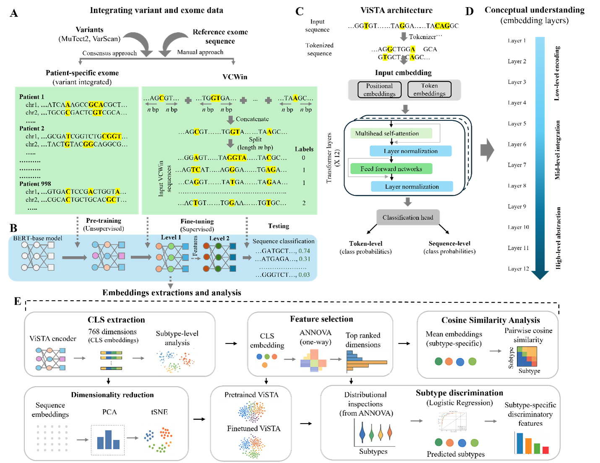

# ViSTA
ViSTA (Variant-integrated Sequence Transformer Architecture) is a BERT-based DNA language model for cancer subtype prediction using patient-specific exome variants. By learning from variant-centered input sequences, ViSTA captures contextual interactions among somatic mutations to identify subtype-discriminative patterns, mutation hotspots, and oncogene signatures. It offers an interpretable, sequence-level framework for mutation-aware precision oncology.

# Requirements and installations
## Dependencies
transformers 4.46.3  
python 3.8.20   
pysam 0.22.1  
torch 1.13.1  
scikit-learn 1.2.2  
numpy 1.24.3  
pandas 2.0.3  
biopython>=1.79  

## Installtaion
1.	Create a virtual environment
   
    conda create -n env_ViSTA python

    conda activate env_ViSTA 

3.	Install python modules in the following way
   
    conda install -c bioconda biopython numpy pandas tqdm scipy scikit-learn

To support NVIDIA GPU environment, install the following packages-

    conda install pytorch torchvision torchaudio pytorch-cuda=11.8 -c pytorch -c nvidia

To install the transformer library (from Hugging Face), use *pip install transformers*

The file env_ViSTA.yml provides a complete list of all dependencies, packages, and their versions required to run the ViSTA environment.

## Installation using git
ViSTA can also be downloaded using the following command. 

    *git clone https://github.com/guda_lab/ViSTA.git*

The model has been tested in Python 3.8.20 environment. We recommend a GPU (NVIDIA CUDA-enabled) to accelerate model pretraining and fine-tuning.

# Fine-tuning ViSTA
## Adjusting parameters and fine-tuning the model via the slurm code

Run the slurm file ft_ViSTA_level1.slurm using the following command

    *sbatch ft_ViSTA_level1.slurm*

The pretrained ViSTA model is stored in the folder ./pt_ViSTA, and is used in the fine-tuning as mentioned in the code below.

The following parameters can be adjusted as per the requirement in the code. 

#--------------------------------------------------------------------------- 

VCWin=4 # size of Variant centered window  
SplitSeqLength=1000 # length of input sequence  
export MAX_LENGTH=512  
export LR=1e-4 #learning rate  
export BASE_DIR="/" # path of the base directory  
export DATA_PATH="${BASE_DIR}/input_data" # Input data for finetuning  
export OUTPUT_DIR="${BASE_DIR}/finetune/ft_ViSTA" # output directory for finetuned model  
export pretrained_ViSTA_MaxLen512="${BASE_DIR}/pretrained" # pretrained model  
--model_name_or_path $pretrained_ViSTA_MaxLen512 \
--tokenizer_name $pretrained_dnabert2_MaxLen512 \
--data_path $DATA_PATH \
--kmer -1 \
--run_name DNABERT2_${LR}_seed${seed} \
--model_max_length ${MAX_LENGTH} \
--per_device_train_batch_size 16 \
--per_device_eval_batch_size 8 \
--gradient_accumulation_steps 4 \
--learning_rate ${LR} \
--num_train_epochs 2000 \
--fp16 \ # Comment or remove to disable
--save_steps 5 \
--output_dir $OUTPUT_DIR \
--save_strategy epoch # Comment or remove to disable  \
--eval_strategy epoch  # Comment or remove to disable  \
--logging_strategy epoch  # Comment or remove to disable  \
--warmup_steps 100  # Comment or remove to disable  \
--overwrite_output_dir True  # Comment or remove to disable  \
--log_level info  # Comment or remove to disable  \
--lr_scheduler_type "linear"  # Comment or remove to disable  \
--find_unused_parameters False  # Comment or remove to disable  \
--use_lora \ # Comment or remove to disable  \
--load_best_model_at_end True  # Comment or remove to disable  \
--metric_for_best_model eval_accuracy  # Comment or remove to disable  \
--greater_is_better True # Comment or remove to disable  \

#---------------------------------------------------------------------------  \

Output \
The output from the fine-tuned model is saved in the ft_ViSTA folder by default, or in a user-specified directory. The following subfolder structure is used to organize the saved results.

#---------------------------------------------------------------------------

ft_ViSTA 
-	best_model  # saved best finetuned model
-	 checkpoint-1 # Intermediate models saved
-	 checkpoint-2
-	 checkpoint-n
-	 results  # evaluation metrics of training, predictions
-	 test_data_used.csv  # test data used for final testing
-	 test_results # evaluation metrics for test data

#---------------------------------------------------------------------------

# Get embedding dimensions
For any given input sequence, extract embedding dimensions in the following way for downstream analysis. 

    *python get_emb.py "AGTGCTGACGAT" 12 512 my_embedding_output.csv*

* sequence ("AGTGCTGACGAT"):  Input DNA sequence
* layer_number (1 to 12): Transformer layer to extract [CLS] embedding from
* max_length (512 or less): Max sequence length (for tokenizer padding/truncation)
* output my_embedding_output.csv: Output file to save the 768 embedding dimensions.
