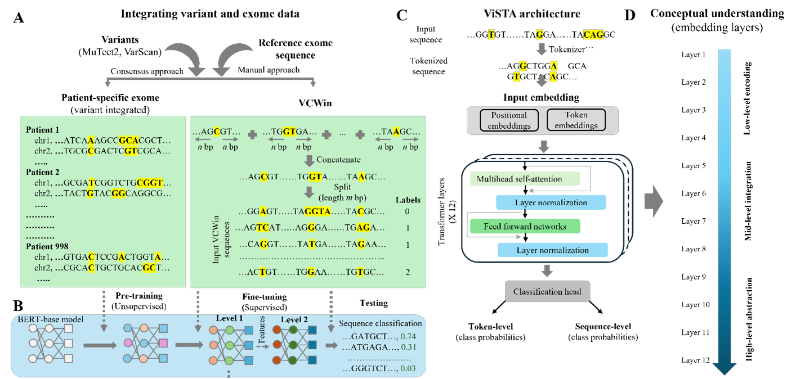

# ViSTA: End-to-End Usage Guide

**Repository:** https://github.com/GudaLab/ViSTA

ViSTA (**V**ariant-integrated **S**equence **T**ransformer **A**rchitecture) is a BERT-based DNA language model for cancer subtype prediction using patient-specific exome variants. By learning from variant-centered input sequences, ViSTA captures contextual interactions among somatic mutations to identify subtype-discriminative patterns, mutation hotspots, and oncogene signatures. It provides an interpretable, sequence-level framework for mutation-aware precision oncology.

<p align="center">
  
</p>

This guide provides a clear, end-to-end workflow for users who want to install ViSTA, obtain the required data/model assets, run fine-tuning, and extract embeddings for downstream analysis.

---

## 1. Repository contents

The main files in this repository are:

- **README.md** — repository overview, requirements, installation, fine-tuning instructions, and embedding extraction example  
- **env_ViSTA.yml** — environment specification for the ViSTA software stack  
- **ft_ViSTA_Level1.slurm** — example SLURM workflow for fine-tuning  
- **ViSTA.py** — main training and fine-tuning entry point  
- **get_emb.py** — utility for extracting layer-specific embedding vectors from an input sequence  

---

## 2. Requirements before running ViSTA

Before running ViSTA, make sure you have the following:

- A Linux environment with Conda
- Preferably, access to an NVIDIA GPU node for efficient training and inference
- Python 3.8.x
- The ViSTA repository cloned locally
- External assets downloaded from Zenodo:
  - `input_data`
  - `pt_ViSTA`
- Sufficient storage for sequence data, checkpoints, logs, and exported embeddings

The repository README reports testing with:

- `transformers 4.46.3`
- `python 3.8.20`
- `pysam 0.22.1`
- `torch 1.13.1`
- `scikit-learn 1.2.2`
- `numpy 1.24.3`
- `pandas 2.0.3`
- `biopython >= 1.79`

---

## 3. Installation workflow

### Step 3.1 Clone the repository

```bash
git clone https://github.com/GudaLab/ViSTA.git
cd ViSTA
```

### Step 3.2 Create and activate the environment

```bash
conda create -n env_ViSTA python
conda activate env_ViSTA
```

### Step 3.3 Install packages

```bash
conda install -c bioconda biopython numpy pandas tqdm scipy scikit-learn
conda install pytorch torchvision torchaudio pytorch-cuda=11.8 -c pytorch -c nvidia
pip install transformers
```

### Optional: use the provided environment file

If you want to create the environment directly from the repository specification:

```bash
conda env create -f env_ViSTA.yml
conda activate env_ViSTA
```

---

## 4. Required external assets and recommended folder layout

Before fine-tuning, download `input_data` and `pt_ViSTA` from Zenodo and place them in the main repository directory.

**Zenodo:** https://doi.org/10.5281/zenodo.17654142

A practical working layout is:

```text
ViSTA/
├── README.md
├── ViSTA.py
├── env_ViSTA.yml
├── ft_ViSTA_Level1.slurm
├── get_emb.py
├── input_data/
├── pt_ViSTA/
└── finetune/
    └── ft_ViSTA/
```

Where:

- `input_data/` contains the prepared input dataset required for fine-tuning
- `pt_ViSTA/` contains the pretrained ViSTA model used as the initialization point
- `finetune/ft_ViSTA/` is a suitable location for storing fine-tuning outputs

---

## 5. End-to-end fine-tuning procedure

### Step 5.1 Review and edit the SLURM configuration

The repository provides `ft_ViSTA_Level1.slurm` as the main example workflow for fine-tuning. Before submitting the job, review and edit the configuration according to your system and data layout.

Common adjustable parameters include:

- `VCWin = 4` — variant-centered window size  
- `SplitSeqLength = 1000` — input sequence length  
- `MAX_LENGTH = 512` — tokenizer/model maximum length  
- `LR = 1e-4` — learning rate  
- `BASE_DIR` — base project directory  
- `DATA_PATH` — input data location  
- `OUTPUT_DIR` — fine-tuning output directory  
- `pretrained_ViSTA_MaxLen512` — pretrained model directory  

Example environment-style setup:

```bash
export BASE_DIR="/path/to/ViSTA"
export DATA_PATH="${BASE_DIR}/input_data"
export OUTPUT_DIR="${BASE_DIR}/finetune/ft_ViSTA"
export pretrained_ViSTA_MaxLen512="${BASE_DIR}/pretrained"
export MAX_LENGTH=512
export LR=1e-4
```

Depending on your cluster, you may also need to adjust:

- number of GPUs
- memory allocation
- CPU allocation
- Conda environment activation
- CUDA device visibility
- checkpoint/output paths

### Step 5.2 Submit the fine-tuning job

After confirming the SLURM configuration, submit the job:

```bash
sbatch ft_ViSTA_Level1.slurm
```

The pretrained ViSTA model is read from `./pt_ViSTA` and used to initialize fine-tuning.

The fine-tuning workflow may include options such as:

- batch size and gradient accumulation
- mixed precision (`fp16`)
- save/evaluation/logging strategy
- scheduler type
- optional LoRA-based adaptation
- best-model selection based on validation accuracy

### Step 5.3 Monitor the output structure

A typical fine-tuning output directory may look like:

```text
ft_ViSTA/
├── best_model/
├── checkpoint-1/
├── checkpoint-2/
├── checkpoint-n/
├── results/
├── test_data_used.csv
└── test_results/
```

Meaning of these outputs:

- **best_model/** — selected fine-tuned model checkpoint  
- **checkpoint-*/** — intermediate model snapshots saved during training  
- **results/** — training and validation outputs  
- **test_results/** — test-set predictions and metrics  
- **test_data_used.csv** — the test subset used in the run  

For downstream analyses and reporting, the most important outputs are typically:

- `best_model/`
- `results/`
- `test_results/`

---

## 6. Embedding extraction workflow

The repository includes `get_emb.py` for extracting layer-specific `[CLS]` embeddings from an input sequence.

Example usage:

```bash
python get_emb.py "AGTGCTGACGAT" 12 512 my_embedding_output.csv
```

### Argument meaning

- **Sequence** — the input DNA sequence  
- **Layer number** — transformer layer index (1 to 12) from which the `[CLS]` embedding is extracted  
- **Max length** — tokenizer padding/truncation limit  
- **Output CSV** — destination file for the exported embedding vector  

In the example above:

- `"AGTGCTGACGAT"` is the DNA sequence
- `12` indicates the 12th transformer layer
- `512` is the maximum sequence length
- `my_embedding_output.csv` is the output file containing the embedding

This script is useful for downstream analyses such as:

- feature exploration
- patient representation analysis
- visualization
- clustering
- external classifier benchmarking

---

## 7. Suggested quick-start workflow

The following shell script provides a concise demonstration workflow that users can adapt directly:

```bash
#!/bin/bash
set -e

git clone https://github.com/GudaLab/ViSTA.git
cd ViSTA

conda env create -f env_ViSTA.yml || true
conda activate env_ViSTA

# Place external assets here before continuing:
#   ./input_data
#   ./pt_ViSTA

# Review/edit ft_ViSTA_Level1.slurm as needed, then submit
sbatch ft_ViSTA_Level1.slurm

# Example post-training embedding extraction
python get_emb.py "AGTGCTGACGAT" 12 512 my_embedding_output.csv
```

This example is intended only as a starting point. Users should adapt paths, resource requests, and filenames according to their local environment and cluster policies.

---

## 8. Practical notes

For smooth execution, keep the following points in mind:

- Verify that `input_data` and `pt_ViSTA` are placed in the expected locations before submitting jobs
- Check SLURM resource requests against your local cluster policy before running the example script
- Confirm that the correct Conda environment is activated
- Review file paths inside `ft_ViSTA_Level1.slurm` before launching
- Use `best_model/` and `test_results/` as the primary outputs for downstream analysis and reporting
- Use `get_emb.py` only after confirming that the correct environment and model assets are available

If you are working on a shared cluster, it is also good practice to:

- test configuration on a small run first
- monitor logs during training
- verify that checkpoints are being written correctly
- confirm available disk space before long runs

---
